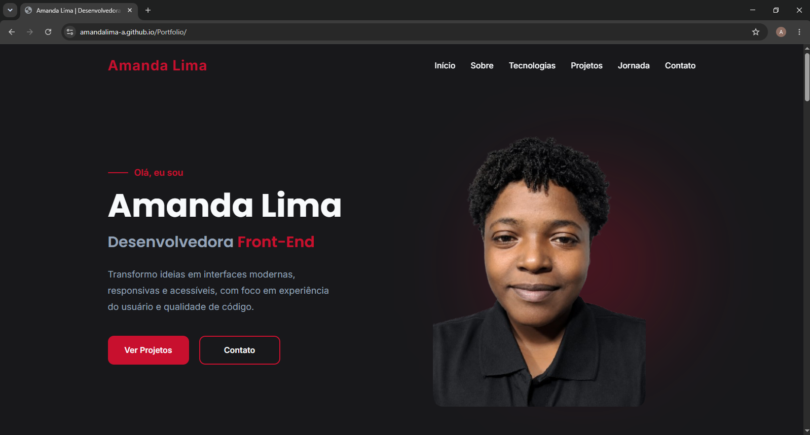

# 🚀 Portfólio | Amanda Lima

Portfólio pessoal desenvolvido para apresentar meus projetos, habilidades e trajetória como desenvolvedora Front-end.

## 👩‍💻 Sobre o projeto

Este portfólio foi desenvolvido para apresentar minha trajetória como desenvolvedora Front-end, minhas principais tecnologias e projetos. O projeto também busca demonstrar conhecimentos em desenvolvimento de interfaces modernas, responsivas e acessíveis.

## 📸 Preview

## 🛠️ Tecnologias utilizadas

- HTML5
- CSS3
- JavaScript
- Font Awesome
- Google Fonts

## ✨ Funcionalidades

- Navegação entre as seções do portfólio
- Menu responsivo para dispositivos menores
- Layout responsivo para diferentes tamanhos de tela
- Apresentação das tecnologias utilizadas
- Apresentação dos projetos desenvolvidos
- Links para visualizar os projetos e seus repositórios
- Formulário de contato funcional
- Envio de mensagens diretamente para o e-mail
- Feedback visual após o envio do formulário

## 🌐 Acesse o projeto

[Visitar portfólio](https://amandalima-a.github.io/Portfolio/)

## 👩‍💻 Autora

**Amanda Lima**

- GitHub: [AmandaLima-a](https://github.com/AmandaLima-a)
- LinkedIn: [Amanda Lima](https://www.linkedin.com/in/amanda-de-jesus-lima/)
